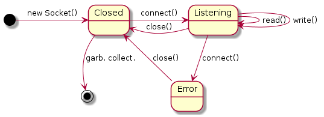

# 2.3 Exercice (State)

**TCP** est un protocole de transfert fiable via le réseau. Dans ce contexte, l'utilisation d'une connexion TCP sur un port spécifique peut être spécifié avec la machine à états suivante.

Implémentez cet énoncé par un programme Java avec le design pattern **State** en vous référant à l'API Java.
