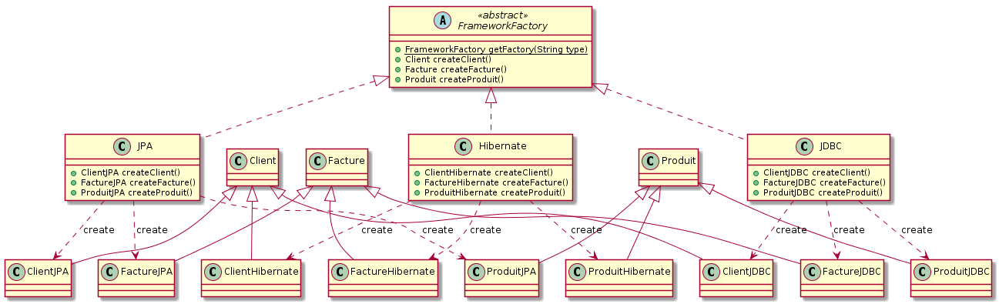

# 2.8 (Factory et DB)

Le modèle de données de notre système est constitué de ces différentes classses :

- `client`,
- `facture`,
- `produit`.

Nous souhaiterions gérer la persistance de ces classes avec différents frameworks (JPA, Hibernate, JDBC, ...) ou de manière "transient" de la manière la plus transparente possible.
Malheureuseemnt, chaque framework nécessite de modifier certaines méthodes.

Expliquez comment le recours au pattern **Abstract Factory** permet de remédier élégamment à cette situation.

> _**transient**_
>
> > _adj._  
> > Passing with time; transitory.
>
> > _adj._  
> > Remaining in a place only a brief time.
>
> > _adj._  
> > Decaying with time, especially as a simple exponential function of time.
>
> Dans ce cas-ci : uniquement en mémoire vive.

## Sans modifier les classes des frameworks

Si on imagine que nous n'avons pas accès en écriture aux classes `JPA`, `Hibernate` et `JDBC` des différents framework, il va nous falloir modifier légèrement le design pattern vu en cours pour arriver à nos fins.

En effet l'héritage multiple n'est pas disponible en Java et il faudra donc passer par une interface `FrameworkFactory` au lieu d'une classe abstraite qui aurait pu se charger de l'instanciation de l'une ou l'autre factory en se basant sur un paramètre quelconque (un code correspondant au framework par exemple).

Une fois que notre "abstract" factory est définie, c'est à dire que les différentes méthodes de création d'artefacts sont déclarées, il nous suffit de créer des classes de factory concrêtes.

- `JPAFactory`
- `HibernateFactory`
- `JDBCFactory`

Ces factory concrêtes vont hériter des différentes classes qui proviennent des différents frameworks, de manière à redéfinir les comportement voulu pour la création des différents artefacts.
Elles vont également implémenter l'interface `FrameworkFactory` de manière à assurer la définition des méthodes qui créent les artefacts.

Finalement, les classes artefacts `Client`, `Facture` et `Produit` peuvent être étendues vers de nouvelles classes.
Celles-ci seront spécifiques aux différents framework.
De cette manière, les modifications qui doivent être effectuées dans le but de s'adapter à tel ou tel framework se trouvent confinées à l'intérieur d'une seule classe.

Cette méthode a l'avantage de ne pas toucher aux classes des frameworks, ce qui est souvent ce que l'objectif recherché lors d'ajout de fonctionnalités.

Par contre cela nous oblige à passer par une classe statique `ConcreteFactory` qui sert uniquement à fournir dynamiquement une factory concrête de type `JPAFactory`, `HibernateFactory` ou `JDBCFactory`.

## En modifiant les classes des frameworks

S'il est toléré de modifier les classes des frameworks, cela simplifie grandement le schéma.

En effet il n'y a plus besoin de créer des classes qui s'intercallent entre la `FrameworkFactory` et les classes des différents framework.
Il est désormais possible d'implémenter les méthodes de création d'artefacts directement dans la classe du framework.

Puisque la `FrameworkFactory` n'est plus une interface, il est maintenant possible d'y définir la méthode statique qui retourne une factory concrête.

